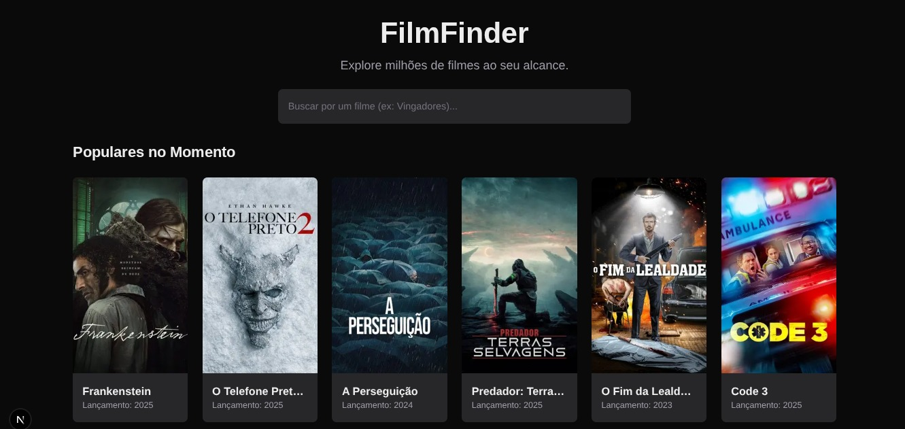
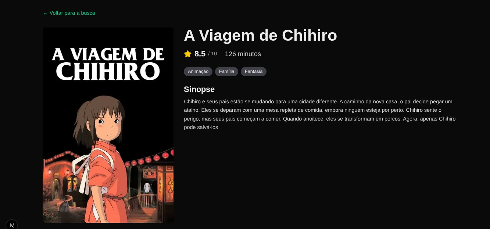

# 🎬 FilmFinder

Um dashboard web moderno para descobrir e pesquisar filmes, construído com Next.js e consumindo a API do TMDB.

[](https://[COLE-O-LINK-DA-SUA-HOSPEDAGEM-VERCEL-AQUI].vercel.app/)

---

## 📸 Screenshots

Aqui está uma prévia da aplicação em funcionamento:

**Página Home (Busca e Populares):**


**Página de Detalhes do Filme:**


---
## ✨ Funcionalidades Principais

* **Busca com "Debounce":** Pesquisa de filmes em tempo real com um atraso de 500ms para otimizar as chamadas de API.
* **Rotas Dinâmicas:** Páginas de detalhes geradas dinamicamente para cada filme (`/movie/[id]`).
* **Paginação "Carregar Mais":** Carregamento de resultados de busca adicionais sem recarregar a página.
* **Gerenciamento de Estado Global:** O estado da busca é gerenciado centralmente com o Zustand.

---

## 🛠️ Stack de Tecnologias

O foco deste projeto foi construir uma aplicação de página única (SPA) reativa e performática, utilizando um stack moderno:

* **Framework:** [Next.js](https://nextjs.org/) (com App Router)
* **Linguagem:** [TypeScript](https://www.typescriptlang.org/)
* **Estilização:** [TailwindCSS](https://tailwindcss.com/)
* **Gerenciamento de Estado:** [Zustand](https://github.com/pmndrs/zustand) (para o estado global da busca)
* **Debounce:** [use-debounce](https://github.com/xnimorz/use-debounce) (para otimização da busca)
* **API:** [TMDB (The Movie Database)](https://www.themoviedb.org/documentation/api)

---

## 🚀 Rodando Localmente

1.  **Clone o repositório:**
    ```bash
    git clone [https://github.com/ggsilva10/film-finder.git](https://github.com/ggsilva10/film-finder.git)
    cd film-finder
    ```

2.  **Instale as dependências:**
    ```bash
    npm install
    ```

3.  **Configure as Variáveis de Ambiente:**
    * Crie um arquivo `.env.local` na raiz.
    * Adicione sua chave da API do TMDB:
        ```env
        NEXT_PUBLIC_TMDB_API_KEY=sua_chave_v3_aqui
        ```

4.  **Rode o servidor de desenvolvimento:**
    ```bash
    npm run dev
    ```

5.  Abra [http://localhost:3000](http://localhost:3000) no seu navegador.
